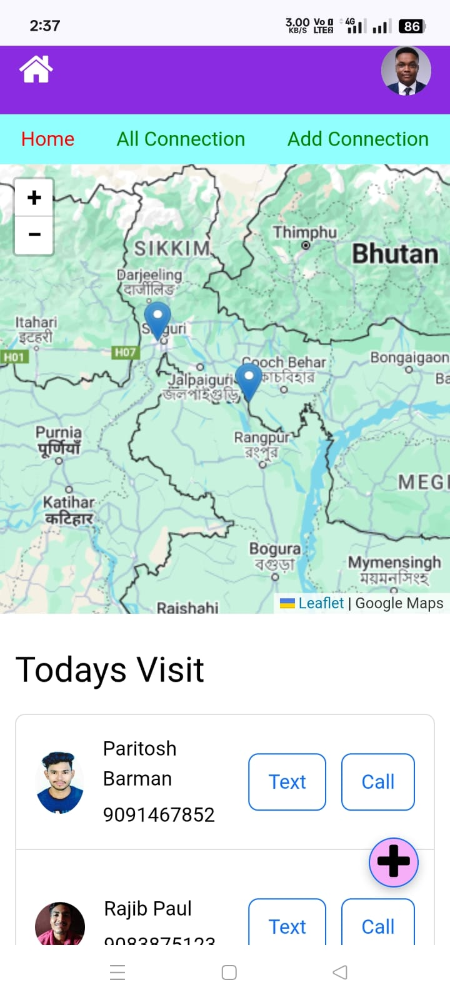

# Smart Field Manager 🗺️📱

**Live Demo:** [smart-field-manager.netlify.app](https://smart-field-manager.netlify.app/)  
**Frontend Repo:** [GitHub - Frontend](https://github.com/ParitoshBarman/Smart-Field-Manager/tree/master/frontend)  
**Backend Repo:** [GitHub - Backend](https://github.com/ParitoshBarman/Smart-Field-Manager/tree/master/backend)

---

**Credentials for Testing:**
  - ✉️ **Email**: `pari@gmail.com`
  - 🔑 **Password**: `123`


---

## 📌 Project Overview

**Smart Field Manager** is a B2B-focused web application that helps track and manage field sales executives and their daily visits to business clients. Built with cost-efficiency and essential features in mind, this solo project is fully functional, scalable, and ready for real-world deployment.

### 🎯 Purpose

Designed for a business owner who wanted to:
- Track all field executives in real-time.
- Log and view visit history.
- Access business client details.
- View business locations on a dynamic map.
- Communicate instantly via call or WhatsApp.

---

## ✨ Features

- 🔐 **Authentication System** (JWT-based)
- 🧑‍💼 **Role-Based Access**:
  - Admin can view all data.
  - Executives see only their own visited business data.
- 📍 **Live Location Tracking**:
  - Businesses visited today shown on the map.
  - Multiple business locations auto-marked.
- 📅 **Today’s Visit Summary**
- 📞 **Direct Communication** via call or WhatsApp from the app
- 🧭 **Integrated Map** to visualize all business visitations
- 📂 File upload support (e.g., client images, business documents)

---

## 🔧 Tech Stack

### Frontend:
- React.js
- Vite
- React Router
- Leaflet (for maps)
- Context API


### Backend:
- Node.js
- Express.js
- MongoDB + Mongoose
- Multer (file upload)
- JWT (authentication)
- dotenv, cors

---

## 🗃️ Folder Structure

```
Smart-Field-Manager/
|____backend
| |____.env
| |____.gitignore
| |____config
| | |____db.js
| |____controllers
| | |____contactController.js
| | |____userController.js   
| |____index.js
| |____middlewares
| | |____authMiddleware.js
| | |____uploadMiddleware.js
| |____models
| | |____BusinessContact.js
| | |____Contact.js
| | |____User.js
| |____node_modules
| |____package-lock.json
| |____package.json
| |____README.md
| |____routes
| | |____contactRoutes.js
| | |____userRoutes.js
| |____server.js
| |____test.txt
| |____uploads
| | |____1747981147068-219293994image004.png
| | |____1747981147069-114666188Paritosh Photo.jpg
| | |____1747981147074-354297697Screenshot (161).png
|____frontend
| |____.env
| |____.gitignore
| |____eslint.config.js
| |____index.html
| |____jsconfig.json
| |____node_modules
| |____package-lock.json
| |____package.json
| |____public
| | |____marker-icon2.png
| | |____vite.svg
| | |_____redirects
| |____README.md
| |____src
| | |____App.css
| | |____App.jsx
| | |____assets
| | | |____marker-icon2.png
| | | |____react.svg
| | |____components
| | | |____AddConnection.jsx
| | | |____AllVisits.jsx
| | | |____BusinessView.jsx
| | | |____CameraCapture.jsx
| | | |____ContactForm.jsx
| | | |____GeoLocationMap.jsx
| | | |____Login.jsx
| | | |____Navbar.jsx
| | | |____ProtectedRoute.jsx
| | | |____Register.jsx
| | | |____SideBar.jsx
| | | |____TodaysVisit.jsx
| | | |____TodaysVisitList.jsx
| | | |____ui
| | | | |____color-mode.jsx
| | | | |____provider.jsx
| | | | |____toaster.jsx
| | | | |____tooltip.jsx
| | |____context
| | | |____AuthContext.jsx
| | |____index.css
| | |____main.jsx
| | |____pages
| | | |____AddConnectionPage.jsx
| | | |____AdminHome.jsx
| | | |____BusinessViewPage.jsx
| | | |____ConnectionListPage.jsx
| | | |____HomePage.jsx
| | | |____ProfilePage.jsx
| | |____styles
| | | |____atenticationform.css
| | | |____businesscontactform.css
| | | |____businessview.css
| | | |____home.css
| | | |____navbar.css
| | | |____todaysvisit.css
| |____test.txt
| |____vite.config.js
|____README.md
```

---

## 🖼️ Screenshots

### 🏠 Home Screen


### 📍 Business Detail with Map


### 🧑‍💼 Business Details (Image View)


### 📊 Business View Details Info


### 📋 Empty Contact Form 1


### 📋 Empty Contact Form 2


### ✅ Filled Contact Form


### 🔗 All Connections View


---

## 🚀 Setup Instructions

### 1. Clone the repository

```bash
git clone https://github.com/ParitoshBarman/Smart-Field-Manager.git
```

### 2. Setup Backend

```bash
cd backend
npm install
cp .env.example .env   # Add MongoDB URI and JWT secret
npm run dev
```

### 3. Setup Frontend

```bash
cd frontend
npm install
npm run dev
```

---

## 👤 Author

**Paritosh Barman**  
- Full Stack Developer  
- GitHub: [@ParitoshBarman](https://github.com/ParitoshBarman)  


---

## 📌 Notes

> This was a **cost-sensitive** project. I focused on implementing only essential features to keep development time minimal and satisfy core client requirements. Future versions may include analytics, executive performance charts, and more advanced admin dashboards.

---

> 📝 Note: This project was built with a mobile-first approach to minimize development costs and meet client requirements within a limited budget.
---

## 🔮 Future Enhancements

- Real-time tracking with GPS
- Push notifications
- Executive performance dashboard
- Multi-language support
- Business filtering by region or category

---

## 📬 Contact

Feel free to connect with me if you have any suggestions, feedback, or opportunities.

📧 Email: paritoshpuitta@gmail.com  
📱 WhatsApp: +919091467852

---
